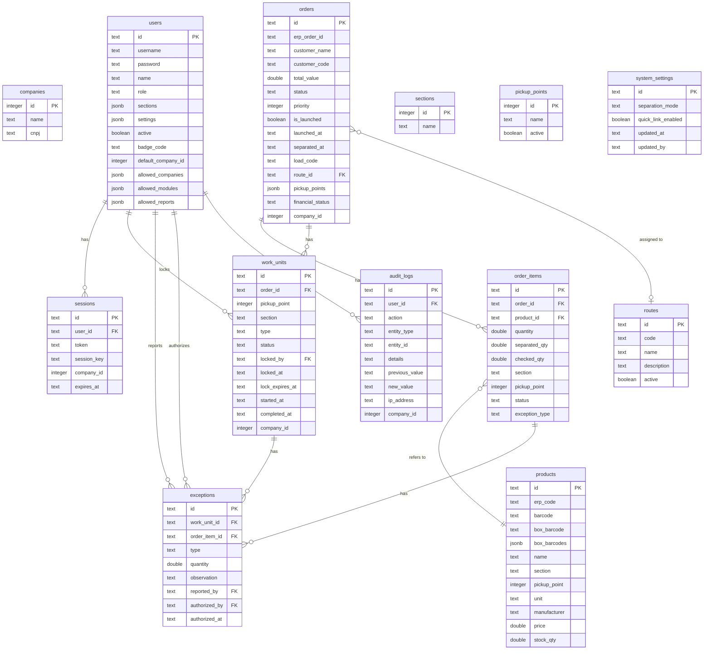
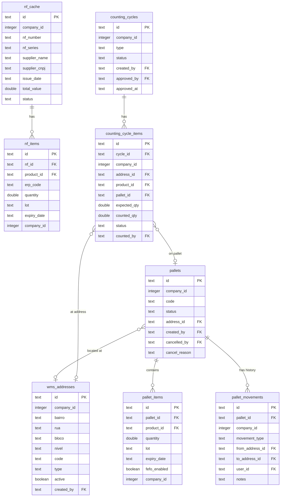
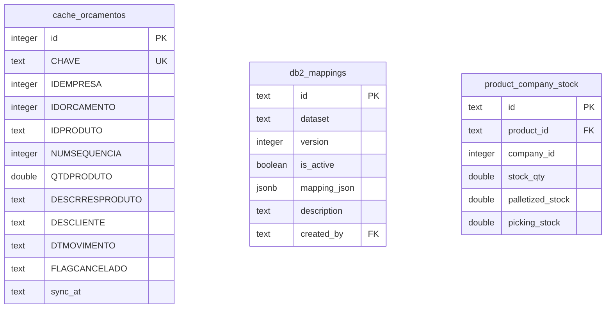

# ERD — ESTRUTURA DO BANCO DE DADOS — STOKER WMS

> Banco: PostgreSQL | ORM: Drizzle ORM | Timestamps: text (ISO 8601) | PKs: text UUID (exceto `companies`, `sections`, `pickup_points` que usam integer)

---

## 1. DIAGRAMA ERD — MERMAID (Núcleo Operacional)

---

## 2. DIAGRAMA ERD — MÓDULO WMS

---

## 3. DIAGRAMA ERD — INTEGRAÇÃO DB2

---

## 4. DETALHAMENTO DE CADA TABELA

### 4.1 `companies`
- **Objetivo:** Cadastro das empresas (tenants) do sistema
- **PK:** `id` (integer — não UUID)
- **Campos críticos:** `id` é usado como `company_id` em todas as outras tabelas
- **Observação:** Populada manualmente. Empresas ativas: 1 e 3. Adicionar nova empresa exige edição de `company-config.ts` e redeploy

---

### 4.2 `users`
- **Objetivo:** Usuários do sistema com perfis e permissões
- **PK:** `id` (UUID gerado por `crypto.randomUUID()`)
- **FKs:** Nenhuma FK obrigatória (companies é referenciada indiretamente)
- **Campos críticos:**
  - `role` — determina acesso a módulos e rotas
  - `sections` (jsonb) — seções permitidas para role `separacao`
  - `allowed_companies` (jsonb) — array de company_ids acessíveis
  - `settings` (jsonb) — `allowMultiplier`, `canAuthorizeOwnExceptions`, `printConfig`
  - `badge_code` — hex 32 chars para login por crachá
  - `active` — se false, login é bloqueado
- **Índices:** `username`, `badge_code`
- **Observação:** Password é hash bcrypt (cost 10). Nunca armazenado em texto claro

---

### 4.3 `sessions`
- **Objetivo:** Sessões de autenticação ativas
- **PK:** `id` (UUID)
- **FKs:** `user_id → users.id`
- **Campos críticos:**
  - `token` — UUID único usado como Bearer token e cookie
  - `session_key` — chave de sessão para o frontend
  - `company_id` — empresa selecionada nesta sessão
  - `expires_at` — TTL de 12 horas
- **Índices:** `token`, `user_id`
- **Observação:** Limpeza automática a cada 1 hora pelo servidor. Login invalida sessões antigas para a mesma combinação user+company

---

### 4.4 `routes` (rotas de entrega)
- **Objetivo:** Rotas de entrega (ex: Zona Norte, Zona Sul)
- **PK:** `id` (UUID)
- **FKs:** Nenhuma
- **Campos críticos:** `code`, `name`, `active`
- **Relação:** Orders podem ser atribuídas a uma rota

---

### 4.5 `sections`
- **Objetivo:** Seções físicas do armazém (corredores/departamentos)
- **PK:** `id` (integer — não UUID)
- **Campos críticos:** `name`
- **Relação:** Produtos pertencem a seções. Usuários `separacao` têm seções permitidas

---

### 4.6 `pickup_points`
- **Objetivo:** Pontos físicos de retirada no armazém
- **PK:** `id` (integer — não UUID)
- **Campos críticos:** `id`, `name`, `active`
- **Relação:** Pontos balcão configurados em `company-config.ts`. Identifica pedidos balcão

---

### 4.7 `orders`
- **Objetivo:** Pedidos de venda sincronizados do ERP
- **PK:** `id` (UUID interno)
- **FKs:** `route_id → routes.id`
- **Campos críticos:**
  - `erp_order_id` — ID único no ERP (UNIQUE). Chave de upsert no sync
  - `status` — ciclo completo do pedido (7 estados)
  - `is_launched` / `launched_at` — controla lançamento para separação
  - `pickup_points` (jsonb) — quais pontos de retirada o pedido usa
  - `financial_status` — status financeiro vindo do ERP
  - `company_id` — isolamento multi-empresa
  - `separation_code` / `load_code` — agrupamento para carregamento
- **Índices:** `status`, `(company_id, status)`, `load_code`
- **Observação:** Pedidos nunca são deletados pelo sync — apenas upsertados

---

### 4.8 `order_items`
- **Objetivo:** Itens de cada pedido com quantidades separadas e conferidas
- **PK:** `id` (UUID)
- **FKs:** `order_id → orders.id`, `product_id → products.id`
- **Campos críticos:**
  - `quantity` — quantidade solicitada pelo cliente
  - `separated_qty` — quantidade efetivamente separada (incremento atômico)
  - `checked_qty` — quantidade conferida (incremento atômico)
  - `section` — seção do produto (determina qual WU processa este item)
  - `status` — pendente → separado → conferido → excecao → recontagem
- **Índices:** `order_id`, `product_id`
- **CRÍTICO:** `separated_qty` e `checked_qty` são atualizados por operações atômicas. Nunca atualizar diretamente sem as funções `atomicIncrement*`

---

### 4.9 `products`
- **Objetivo:** Catálogo de produtos sincronizados do ERP
- **PK:** `id` (UUID)
- **Campos únicos:** `erp_code` (UNIQUE)
- **Campos críticos:**
  - `barcode` — código de barras unitário
  - `box_barcode` — código de caixa simples
  - `box_barcodes` (jsonb) — array de `{code: string, qty: number}` para múltiplas embalagens
  - `section` — determina em qual WU o item aparece
  - `pickup_point` — ponto de retirada do produto
- **Índices:** `barcode`, `section`
- **Observação:** Produtos com `box_barcodes` nulos ou vazios usam `box_barcode` como fallback

---

### 4.10 `work_units` (WU)
- **Objetivo:** Unidades de trabalho — a unidade operacional fundamental do sistema
- **PK:** `id` (UUID)
- **FKs:** `order_id → orders.id`, `locked_by → users.id`
- **Campos críticos:**
  - `type` — "separacao" ou "conferencia". **BALCÃO usa "separacao"**
  - `section` — seção (null em modo `by_section`)
  - `pickup_point` — ponto de retirada (usado para identificar balcão)
  - `status` — pendente → em_andamento → concluido → recontagem → excecao
  - `locked_by` — usuário com lock ativo (null = livre)
  - `locked_at` — timestamp do lock (PRESERVADO após conclusão para timer)
  - `lock_expires_at` — expiração do lock (TTL 60 min). ZERADO no unlock
  - `started_at` — início da operação
  - `completed_at` — conclusão
  - `company_id` — isolamento multi-empresa
- **Índices:** `order_id`, `(company_id, status)`, `locked_by`
- **CRÍTICO:** Ao desbloquear, zerar SEMPRE `locked_by` E `lock_expires_at`. O `locked_at` pode ser preservado

---

### 4.11 `exceptions`
- **Objetivo:** Exceções reportadas durante separação/conferência
- **PK:** `id` (UUID)
- **FKs:** `work_unit_id → work_units.id`, `order_item_id → order_items.id`, `reported_by → users.id`, `authorized_by → users.id`
- **Campos críticos:**
  - `type` — nao_encontrado | avariado | vencido
  - `quantity` — quantidade com problema
  - `authorized_by` / `authorized_at` — controle de autorização pelo supervisor
- **Observação:** Exceção não autorizada impede conclusão da WU por padrão

---

### 4.12 `audit_logs`
- **Objetivo:** Registro imutável de todas as ações relevantes
- **PK:** `id` (UUID)
- **FKs:** `user_id → users.id`
- **Campos críticos:**
  - `action` — tipo da ação (ex: "login", "unlock_work_unit", "authorize_exception")
  - `entity_type` / `entity_id` — o que foi afetado
  - `previous_value` / `new_value` — diff de estado
  - `ip_address` — para rastreabilidade
  - `company_id` — isolamento multi-empresa
- **Observação:** Sem DELETE nessa tabela. Cresce indefinidamente

---

### 4.13 `picking_sessions`
- **Objetivo:** Lock exclusivo para separação via **handheld** (coletor de dados)
- **PK:** `id` (UUID)
- **FKs:** `user_id → users.id`, `order_id → orders.id`
- **Campos críticos:**
  - `section_id` — seção bloqueada
  - `last_heartbeat` — TTL via heartbeat (2 minutos de inatividade = lock liberado)
- **Observação:** Sistema diferente do lock de WUs. Usado especificamente pelo fluxo handheld

---

### 4.14 `system_settings`
- **Objetivo:** Configurações globais do sistema (singleton)
- **PK:** `id` = literal `"global"` (única linha)
- **Campos críticos:**
  - `separation_mode` — "by_order" | "by_section"
  - `quick_link_enabled` — habilita atalho rápido na home
- **Observação:** Cacheada por 30s no servidor. Mudança invalida o cache imediatamente

---

### 4.15 `cache_orcamentos`
- **Objetivo:** Cache bruto dos dados do ERP DB2 (orçamentos = pedidos)
- **PK:** `id` (serial)
- **Chave única:** `CHAVE` — string composta (empresa + orçamento + produto + sequência)
- **Campos:** Todos em MAIÚSCULO (convenção DB2)
- **Observação:** Populada pelo `sync_db2.py`. Serve de staging antes de popular `orders` e `order_items`

---

### 4.16 `db2_mappings`
- **Objetivo:** Configurações de mapeamento de campos DB2 → campos internos
- **PK:** `id` (UUID)
- **Campos críticos:**
  - `dataset` — qual tabela/conjunto mapear
  - `is_active` — somente um mapeamento ativo por dataset
  - `mapping_json` (jsonb) — array de `MappingField`
- **Observação:** Editado via Mapping Studio (`/supervisor/mapping-studio`)

---

### 4.17 `product_company_stock`
- **Objetivo:** Estoque por produto × empresa
- **PK:** `id` (UUID)
- **Chave única:** `(product_id, company_id)`
- **FKs:** `product_id → products.id`
- **Campos:** `stock_qty`, `palletized_stock`, `picking_stock`
- **Observação:** Atualizado a cada sync DB2

---

### 4.18 Tabelas WMS

| Tabela | Objetivo |
|---|---|
| `wms_addresses` | Endereços físicos do armazém (bairro/rua/bloco/nível) |
| `pallets` | Pallets físicos com status e localização |
| `pallet_items` | Itens em cada pallet com lote e validade |
| `pallet_movements` | Histórico de movimentações de pallets |
| `nf_cache` | Cache de notas fiscais recebidas |
| `nf_items` | Itens das notas fiscais |
| `counting_cycles` | Ciclos de contagem cíclica de inventário |
| `counting_cycle_items` | Itens de cada ciclo de contagem |

---

## 5. OBSERVAÇÕES GERAIS DO BANCO

| Aspecto | Implementação |
|---|---|
| PKs texto | `crypto.randomUUID()` — UUIDs v4 |
| PKs inteiras | `companies`, `sections`, `pickup_points` (IDs do ERP) |
| Timestamps | `text` em formato ISO 8601 — **sem tipo TIMESTAMP nativo** |
| Migrations | `runSafeMigrations()` com `ADD COLUMN IF NOT EXISTS` — sem versionamento formal |
| Índices | Criados manualmente no `index.ts` com `CREATE INDEX IF NOT EXISTS` |
| Constraints | FKs definidas no schema mas sem CASCADE — deleção deve ser manual |
| Multi-tenant | Isolamento por `company_id` em todas as tabelas operacionais |
| Soft delete | Usuários: `active = false`. Rotas: `active = false`. Dados operacionais: sem delete |

---

*Baseado em `shared/schema.ts` e `server/index.ts` (runSafeMigrations)*
