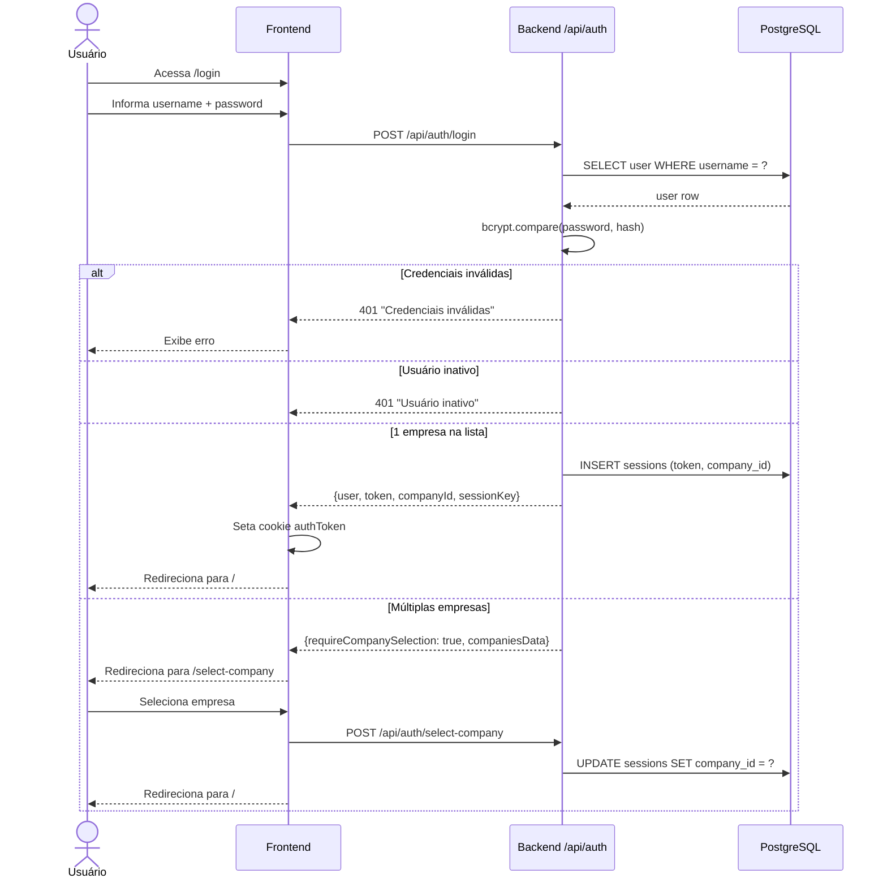
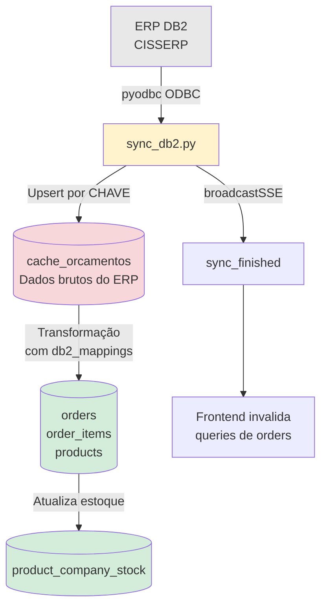
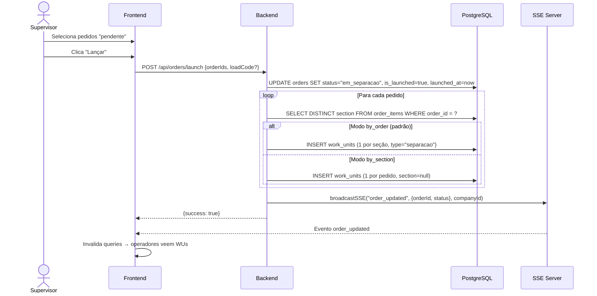
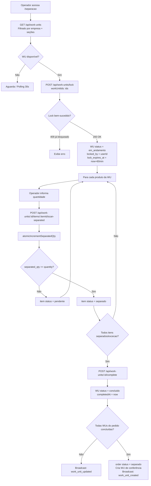
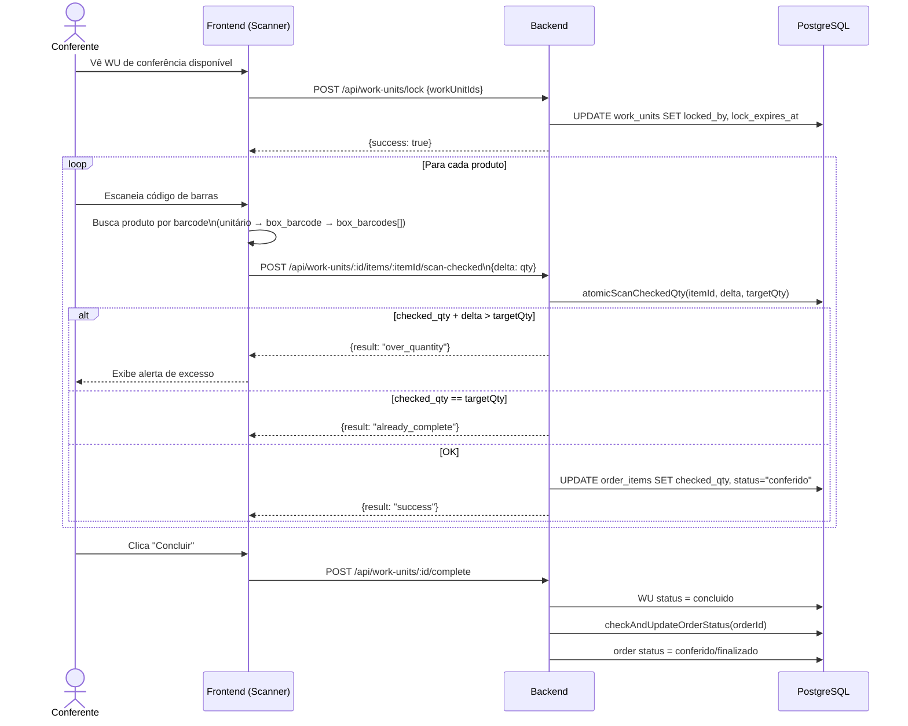
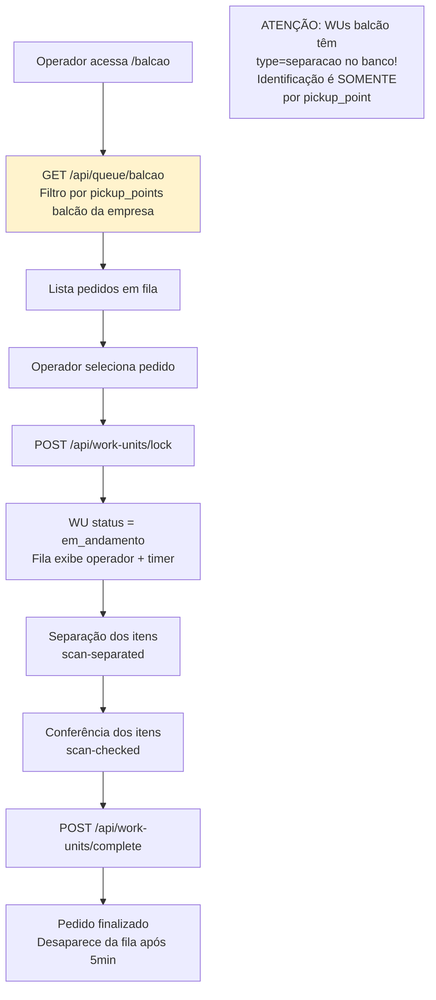
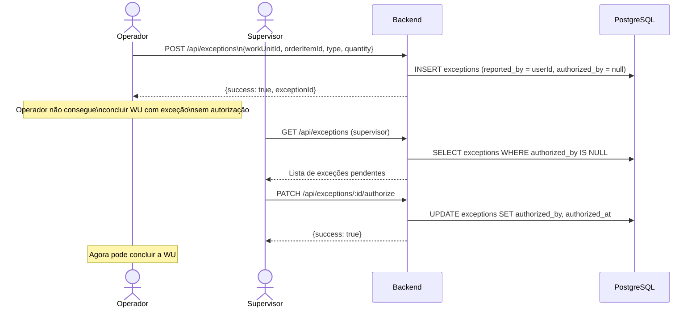
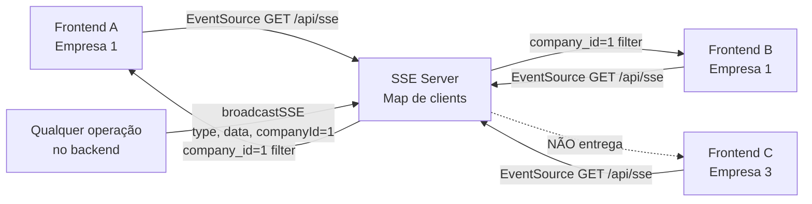
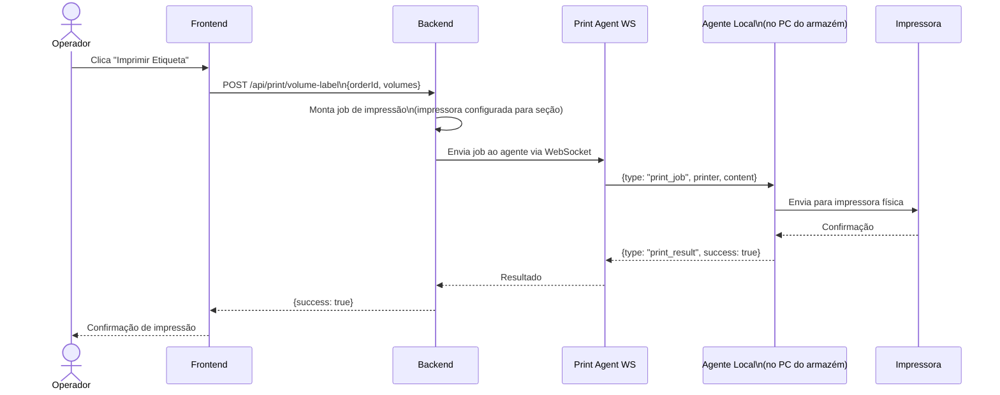
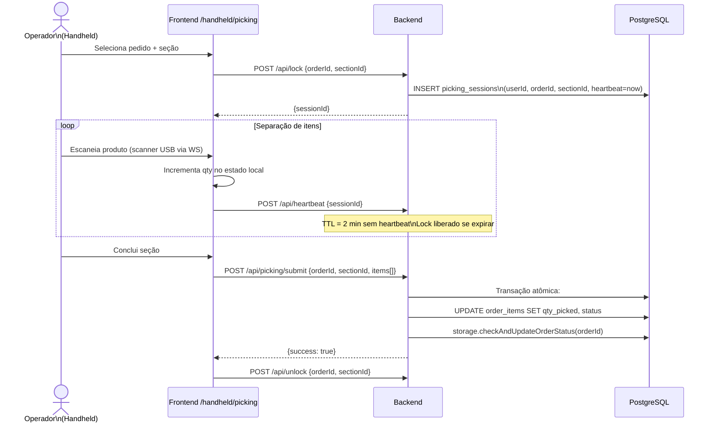

# FLUXOS CRÍTICOS — STOKER WMS

> Diagramas e descrições passo a passo dos fluxos mais importantes do sistema.  
> Diagramas em Mermaid quando possível; descrição textual como complemento.

---

## FLUXO 1 — LOGIN E SELEÇÃO DE EMPRESA



---

## FLUXO 2 — PEDIDO: DO ERP ATÉ O SISTEMA



**Detalhamento:**
1. Script Python `sync_db2.py` conecta via ODBC ao IBM DB2 na rede local (192.168.1.200:50000)
2. Consulta orçamentos dos últimos 31 dias
3. Faz upsert em `cache_orcamentos` usando `CHAVE` como chave única (incremental, nunca deleta)
4. Aplica mapeamento configurável (`db2_mappings.mapping_json`) para transformar campos DB2 → campos internos
5. Popula `orders`, `order_items`, `products`, `product_company_stock`
6. Emite SSE `sync_finished` ao concluir
7. Frontend invalida queries e recarrega pedidos automaticamente

---

## FLUXO 3 — LANÇAMENTO DE PEDIDO



---

## FLUXO 4 — SEPARAÇÃO COMPLETA



**Proteção de sessão:**
- `sessionStorage` persiste `{workUnitIds, orderIds}` a cada mudança
- Ao recarregar: valida `lockedBy === userId` AND `lockExpiresAt > now` AND `orderId in saved.orderIds`

---

## FLUXO 5 — CONFERÊNCIA COM BARCODE



---

## FLUXO 6 — BALCÃO



**Identificação balcão:**
```
Empresa 1 → pickup_points balcão: [1, 2]
Empresa 3 → pickup_points balcão: [52, 54]
Configurado em: server/company-config.ts
```

---

## FLUXO 7 — EXCEÇÃO E AUTORIZAÇÃO



**Exceção sem autorização:**
- Operador com `settings.canAuthorizeOwnExceptions = true` pode autorizar a própria exceção
- Tipos: `nao_encontrado`, `avariado`, `vencido`

---

## FLUXO 8 — UNLOCK E RESET

### 8A — Operador desbloqueia própria WU

```
1. Operador clica "Abandonar" / "Desbloquear"
2. POST /api/work-units/unlock {workUnitIds: [id]}
3. Backend: assertLockOwnership → validado
4. UPDATE work_units SET locked_by=null, lock_expires_at=null
5. WU volta para status anterior (pendente se estava em_andamento)
6. broadcastSSE("work_units_unlocked", ...)
```

### 8B — Supervisor desbloqueia WU de outro operador

```
1. Supervisor seleciona WUs na interface
2. POST /api/work-units/batch-unlock {workUnitIds: [...]}
3. Backend: role supervisor/admin → sem verificação de ownership
4. Para cada WU: locked_by=null, lock_expires_at=null
5. Se status era em_andamento → volta para pendente
6. Cria audit_log com ação "batch_unlock"
7. broadcastSSE → todos os operadores são notificados
```

### 8C — Session Restore ao recarregar

```
1. Operador recarrega a página
2. Frontend: loadSession() do sessionStorage
3. Valida cada WU salva:
   a. lockedBy === userId ✓
   b. lockExpiresAt > now ✓
   c. orderId ∈ saved.orderIds ✓
4. Se válido → restaura step="checking", workUnitIds
5. Se inválido → clearSession(), operador começa do zero
6. Fallback: busca qualquer WU com lockedBy === userId na API
```

---

## FLUXO 9 — SSE / ATUALIZAÇÃO EM TEMPO REAL



**Eventos e reações no frontend:**

| Evento SSE | Quem escuta | Reação |
|---|---|---|
| `work_unit_updated` | Separação, Conferência, Balcão | Invalida query de WUs |
| `work_unit_created` | Conferência, Supervisor | Invalida query de WUs |
| `order_updated` | Fila de Pedidos, Supervisor | Invalida query de orders |
| `work_units_unlocked` | Separação, Conferência | Invalida query de WUs |
| `sync_finished` | Supervisor, Fila | Invalida queries de pedidos |
| `picking_update` | Handheld | Atualiza estado do picking |
| `lock_acquired` | Handheld | Notifica lock adquirido |
| `lock_released` | Handheld | Notifica lock liberado |

**Heartbeat:** `: ping\n\n` a cada 30s para manter conexão via proxies  
**Reconexão:** EventSource reconecta automaticamente se a conexão cair

---

## FLUXO 10 — WMS BÁSICO (Recebimento e Movimentação)

```mermaid
flowchart TD
    A[NF chega da ERP\nem nf_cache] --> B[Recebedor acessa\n/wms/recebimento]
    B --> C[Seleciona NF pendente]
    C --> D[POST /api/wms/pallets\nCria pallet com itens da NF]
    D --> E[Pallet status: sem_endereco\nItems: produto+qtd+lote+validade]

    E --> F[Empilhador acessa\n/wms/checkin]
    F --> G[Escaneia QR code do pallet]
    G --> H[POST /api/wms/pallets/:id/allocate\n{addressId}]
    H --> I[Pallet status: alocado\nPallet vinculado ao endereço WMS]
    I --> J[INSERT pallet_movements\ntype: allocated]

    I --> K[Empilhador: Transferência]
    K --> L[POST /api/wms/pallets/:id/transfer\n{toAddressId}]
    L --> M[Pallet muda de endereço\nINSERT pallet_movements: transferred]
```

---

## FLUXO 11 — IMPRESSÃO DE ETIQUETAS



---

## FLUXO 12 — HANDHELD (COLETOR DE DADOS)



**Deduplicação:** Cada item enviado tem um `msgId` UUID. Se o mesmo `msgId` chegar 2x (retry de rede), o segundo é ignorado via `scanLog`.

---

## RESUMO — MAPA DE DEPENDÊNCIAS ENTRE FLUXOS

```
sync_db2.py
    └── popula: cache_orcamentos → orders → order_items → products
                                                                ↓
                                                    Supervisor lança pedidos
                                                                ↓
                                                    WUs criadas (separacao)
                                                                ↓
                                                    Operador separa (lock → scan → complete)
                                                                ↓
                                                    WU conf criada automaticamente
                                                                ↓
                                                    Conferente confere (lock → scan → complete)
                                                                ↓
                                                    Pedido finalizado
                                                                ↓
                                                    Fila de pedidos oculta após 5min
```

---

*Diagramas baseados na implementação real de `server/routes.ts`, `server/storage.ts` e módulos do frontend*
